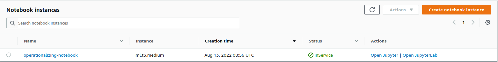
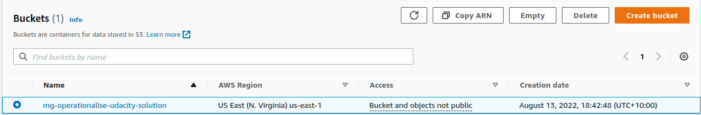

# Operationalising Machine Learning
Author: Mitchell Gray
Date: 2022-08-14
```toc 
style: number 
min_depth: 1 
max_depth: 6 
```
## Training
### Notebook Size Selection

The project we are seeking to operationalise is a RESNET50 fine tuning for the purposes of predicting the breed of a dog depicted by an image.

However, close reading of the notebook describing the processes to be follows indicates that the processing that this notebook will need to do will be limited to downloading the images at first instance and then triggering training jobs and deployments on other infrastructure.

As a result, we should select the smallest instance type possible. 

Consulting the AWS prices for notebook instances we find that the cheapest is ml.t2.medium. 

![[./screenshots/aws_prices_notebook.png|AWS Notebook Prices]]


I selected this instance size for the working notebook for this project.



### Creation of S3 Bucket

In order to hold the data for this project, I created an s3 bucket 'mg-operationalise-udacity-solution'



### Single Instance Training

The single instance training was completed on the notebook and the resulting endpoint was:

![[./screenshots/endpoint_single_train.png|Output of the Single Training Endpoint]]

### Multi-Instance Training
After completing the single instance training exercise, I altered the code block to conduct multi-instance training. The code used to do this is in the .ipynb file in this repo. The endpoint produced was:

![[./screenshots/endpoint_distributed_train.png]]

## EC2 Training
### Instance Selection
The code used for training on the EC2 image is not designed to run on a GPU. While it would be possible to alter the code to do this, it didn't make sense to do so if acceptable performance could be achieved without doing so. However, I elected to look at compute optimised instances that had enough memory for my application but which were not too expensive. This workflow will fit relatively comfortably within 8GB of memory. Therefore the `c4.xlarge` instance seemed appropriate.

![[./screenshots/ec2_c_prices.png]]

Upon looking up the prices for this instance, I found that the price was relatively cheap at $0.17 per hour in the US-East1 SageMaker region:

![[./screenshots/ec2_price.png]]

I elected to start up this instance and configure it using an image which provided access to Pytorch -  in this case Deep Learning AMI GPU Pytorch 1.12.0.

![[./screenshots/ec2_running.png]]

I configured this instance to only accept ssh connections from my home computer which I then used to remote into the machine and complete the training job:

![[./screenshots/ec2_training.png]]
In order to get the training working, I needed to activate the conda environment which contained the pytorch library. As seen in the screenshot above, this was completed using:

```bash
conda info --envs
```

to identify the environments available on the EC2 instance and then:

```bash
conda activate pytorch
```

to activate the relevant environment.

Prior to this, I had copied the contents of the starter file into solution.py and was able to run it. The screenshot of the saved model weights is below:

![[./screenshots/ec2_saved_file.png]]

### Code Differences
#### Argument Parsing
Training on EC2 compared with trianing on Sagemaker requires slight differences in the configuration of the script. In the case of Sagemaker, it is possible to create model code as an entry point and use Sagemaker functions to pass desirable hyperparameters to this code when invoking the training job. As a result, the script expects to be called by the system and to have these values passed as arguments using the `argparse` library.

The code from the `hpo.py` code. 

```python
if __name__=='__main__':
    parser=argparse.ArgumentParser()
    parser.add_argument('--learning_rate', type=float)
    parser.add_argument('--batch_size', type=int)
    parser.add_argument('--data', type=str, default=os.environ['SM_CHANNEL_TRAINING'])
    parser.add_argument('--model_dir', type=str, default=os.environ['SM_MODEL_DIR'])
    parser.add_argument('--output_dir', type=str, default=os.environ['SM_OUTPUT_DATA_DIR'])
    
    args=parser.parse_args()
```

By comparison, the EC2 environment is significantly more closed. While it would be possible to configure a script to accept arguments when invoked from the EC2 SSH, it would only be possible to pass these arguments from the terminal shell instance connected to the SSH session. 

The use of these arguments in the `hpo.py` script is to enable repeated invocation of this script programatically. When training on the EC2 environment these hyperparameters are invoked inline and without the use of a `main` function or block.

#### Sagemaker Use of Environment Variables

This difference is visible in the code snippet above from the Sagemaker. For sagemaker, the environment variables are set by the code which spins up the training instance(s). The information is placed into environment variables to enable necessary parameters for training (hyperparamater values, data paths, model paths, etc) to be accessible by the training job at runtime.

## Lambda Function Setup
In order to deploy this model in production, it is necessary to create AWS Lambda functions to invoke the endpoint when a request is received and receive the output. 

The starter code provided a `lambdafunction.py` starter file which is to be used to accomplish this.

### Code Modification
The parallel training job created above and deployed to an endpoint is to be made the target of the Lambda function. I modified the following line from:

```python
endpoint_Name='BradTestEndpoint'
```

to

```python
endpoint_Name='pytorch-inference-2022-08-13-12-29-03-528'
```

However, this Lambda function will still not work until the appropriate IAM policy is attached to the Lambda execution role.

### Lambda Function Code

#### General Structure
The lambda function script consists mainly in a single function `lambda_handler` which takes two arguments;

1. Event
	1. An event is an JSON object which is used as th request format for the endpoint
2. Context
	1. Provides information about the thing which invokes the endpoint, how it is invoking the endpoint and other important information which may be used to alter how the Lambda function processes the request. See dos [here](https://docs.aws.amazon.com/lambda/latest/dg/python-context.html)

The invocation of the endpoint will be discussed later, but the code then invokes the endpoint, obtains the response, decodes it and creates a JSON object which is to be returned to the requester which provides the model's predictions for the provided input. 

In general, it is a requirement that the Lambda function include a statusCode key to allow the recipient to understand that the content received is a valid response which is a result of successful invocation of the function. The body is used to provide the endpoint prediction in the form of a json dump which can be intepretted by the recipient. 

#### Sagemaker Endpoint Invocation
When created a lambda function, it is important to note that it is not possible to import non-standard third party libraries and it is not possible to invoke installation through either `conda` or `pip`. As such, when creating a lambda function, if it is necessary to use these libraries, one would need to install versions of these libraries on a machine of identical configuration to the Lambda function executors and zip these scripts, along with the lambda function itself into a folder which can be uploaded.

This is practically very difficult, so it is desireable to use as few third party libraries as possible. As a result, invocation of endpoints is generally not done using the AWS `sagemaker` library, but rather using the `boto3` sagemaker runtime. 

This allows endpoint invocation using only `boto3`, `json` and encoding libraries required for your application.


### IAM Role configuration

Owing to an AWS reset problem with my Udacity account, I created a Lambda execution role from scratch for this Lambda function. In order to have access to the Sagemaker parts of the AWS environment, it is necessary to attach a policy which allows access.

Initially, I provided the Lambda execution role with a Sagemaker Full Access policy. However, it is a principle of good security design that the lowest privilege possible which does not obstruct the business process should be granted. In this case the policy I chose to attach was [AmazonSageMakerServiceCatalogProductsLambdaServiceRolePolicy](https://us-east-1.console.aws.amazon.com/iam/home#/policies/arn:aws:iam::aws:policy/service-role/AmazonSageMakerServiceCatalogProductsLambdaServiceRolePolicy). This policy grants Lambda access to a limited range of Sagemaker services. AWS' description of this service is:

>Service role policy used by the AWS Lambda within the AWS ServiceCatalog provisioned products from Amazon SageMaker portfolio of products.

I believe that this represents a relatively low security privilege which trades off convenience of not writing my own json policy definition with the need to not provide full access to the lambda function IAM role.

The screenshot of my execution role with the relevant policy attached is below:
![[./screenshots/lambda_iam_policies.png]]

In general, AWS IAM roles should be reviewed regularly to ensure that services still need access to the policies which are attached to their execution roles. Additionally, regular review of IAM roles and user accounts allows for regular removal of outdated policies which may provide potential vectors for attach. AWS IAM allows convenient creation of security policies which meet most needs and the JSON definition for policies means that if there is a specific use case, you can create a policy which meets those precise needs. The provision of execution roles to services ensures that a service cannot exceed its allotted authority, accruing extra charges or potentially leading to the exposure of sensitive data held within the environment. 

I believe as a result of my security policies that this endpoint and the AWS environment are secure. 

### Lambda Function Test

After attaching this group policy, the suggested test object in the course documentation was created for the Lambda function and a test was run. Screenshots of this test are included below:

![[./screenshots/lambda_test_result_top.png]]

This shows the body of 33 nubmers included in the prediction which is the response from the endpoint.

![[./screenshots/lambda_test_result.png]]

## Concurrency & Autoscaling
In order to make a model commercially viable it is necessary to allow concurrent requests to be received and processed and autoscaling of the model endpoint to occur to service these requests.

### Concurrency
In order to allow concurrency for the Lambda function, it is necessary to publish a version of it and have this version used for the concurrency. The published version is below:

![[./screenshots/lambda_version.png]]

My assumptions for this project is that this dog classification system will be operated by a low budget enterprise and will receive little traffic. My own affection for precision in the discussion of dog breeds notwithstanding, the general public is unlikely to clamour for very high throughput and extremely low latency access to dog breed classification tools. As a result, I have elected to set both the reserved concurrency and the provisioned concurrency to low values: 5 and 3 respectively.

![[./screenshots/lambda_concurrency.png]]

These numbers will ensure that there is sufficient capacity for a modest amount of calls to the endpoint but not so much as to significantly tax the financial resources of the enterprise.

After configuring concurrency, another test of the endpoint was performed to ensure that it was still functioning well.

![[./screenshots/lambda_concurrency_test.png]]

### Autoscaling

In the event that there are a large number of requests for the endpoint, it is desirable to configure the endpoint to scale out to additional instances to meet demand. In line with the assumptions of the previous section, I have assumed that a small amount of autoscaling is permissible but it should be for a small amount of instance (I have selected a minimum of 1 and a maximum of 3 instances) and that the scale in and scale out cool down settings should ramp slowly and cut back quickly. 

As a result, I ahve selected a scale in cool down of 300 meaning that the endpoint will wait a significant amount of time at high usage prior to scaling out to an additional instance. Additionally,  the scale out cool down has been set to a low value of 30, meaning that the endpoint will wait a shorter amount of time before shedding unutilised instances. While this may lead to bursty performance, it will ensure minimal cost for what is expected to be a fairly low usage endpoint.

Finally, I have selected a target value of 25 which is the number of concurrent or nearly concurrent endpoing activations per instance prior to the threshold for high usage being reached. 

![[./screenshots/endpoint_autoscaling_config.png]]

The number of instances permissible for auto scaling is present in the image below along with evidence that the settings were deployed correctly.

![[./screenshots/endpoint_autoscaling_running.png]]
